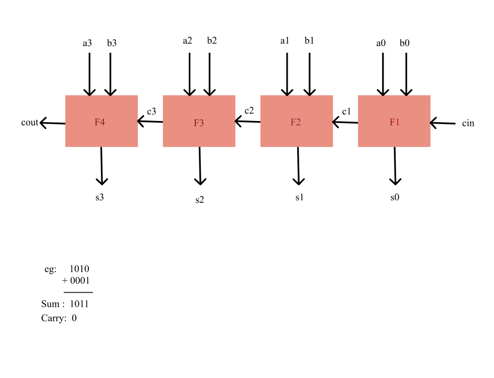

# 4 Bit Adder

This project simulates a **4-bit adder** using four full adders in Verilog. It takes two 4-bit numbers `a` and `b` along with a carry input `cin`, and produces a 4-bit sum output `s` and a carry output `cout`.

The adder is written using behavioral modeling and includes a testbench for simulation.

---

## 🔧 Block Diagram



The circuit consists of:
- 4 full adders (F1 to F4)
- Ripple carry logic connecting the full adders
- Inputs: `a[3:0]`, `b[3:0]`, and `cin`
- Outputs: `s[3:0]` and `cout`

---

## 📁 Files

- `adder.v` – Contains the 4-bit adder module and full adder definition
- `adder_tb.v` – Testbench to verify the functionality
- `adder.vcd` – Dumped waveform file (generated after simulation)
- `block_diagram.png` – 4-bit adder architecture image
- `waveform.png` – Sample GTKWave output screenshot

---

## ▶️ How to Simulate

```bash
iverilog -o adder.vvp adder.v adder_tb.v
vvp adder.vvp
gtkwave adder.vcd
